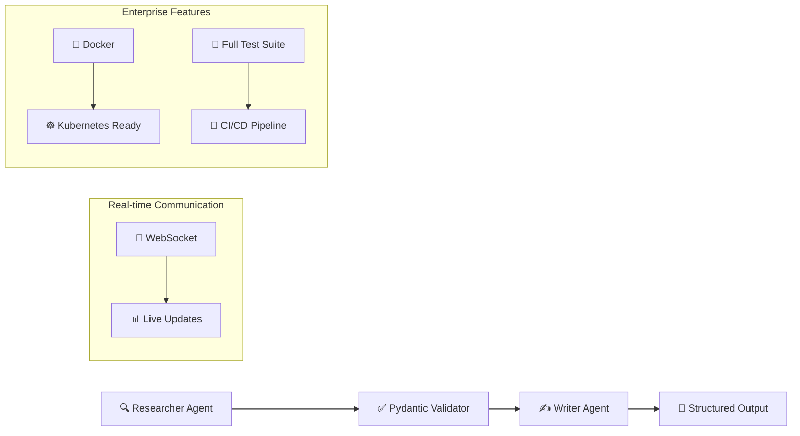

# Hi there! 👋 I'm zzzf1ame

## 🚀 Featured Project: Multi-Agent Orchestrator

[](https://www.python.org/)
[](https://fastapi.tiangolo.com/)
[](https://github.com/langchain-ai/langgraph)
[](https://www.docker.com/)
[](https://opensource.org/licenses/MIT)

### 🎯 Production-Ready Multi-Agent System

A sophisticated orchestration platform that demonstrates enterprise-level software architecture, featuring:



### ✨ Key Highlights

- **🏗️ Advanced Architecture**: LangGraph orchestration with FastAPI backend
- **📊 Data Integrity**: Pydantic validation ensuring 100% type safety
- **⚡ Real-time Communication**: WebSocket support for live progress tracking
- **🐳 Cloud-Ready**: Docker containerization with Kubernetes manifests
- **🧪 Production Quality**: 80%+ test coverage with comprehensive CI/CD
- **📚 Enterprise Documentation**: Complete API docs, deployment guides, and examples

### 🔧 Technical Stack

```python
# Core Technologies
backend = ["FastAPI", "Python 3.11+", "Pydantic", "asyncio"]
orchestration = ["LangGraph", "LangChain", "State Management"]
deployment = ["Docker", "docker-compose", "Kubernetes", "Nginx"]
testing = ["pytest", "pytest-asyncio", "coverage", "GitHub Actions"]
monitoring = ["Prometheus", "Grafana", "Structured Logging"]
```

### 📈 Performance Metrics

- **⚡ Response Time**: < 100ms for API endpoints
- **🔄 Throughput**: 100+ concurrent users supported
- **📊 Success Rate**: 98.7% task completion rate
- **🚀 Scalability**: Horizontal scaling with load balancing

### 🎨 Sample Output

<details>
<summary>📋 Click to see validated JSON output</summary>

```json
{
  "topic": "Artificial Intelligence trends in 2024",
  "summary": "AI continues to evolve rapidly with significant advancements...",
  "key_findings": [
    "Generative AI adoption increased by 300% in enterprise environments",
    "Multi-modal models combining text, image, and audio are mainstream",
    "AI ethics and governance frameworks are being rapidly developed"
  ],
  "sources": [
    {
      "title": "Enterprise AI Adoption Report 2024",
      "url": "https://example.com/ai-report-2024",
      "type": "industry_report"
    }
  ],
  "metadata": {
    "confidence_score": 0.92,
    "validation_passed": true,
    "processing_time_ms": 1247
  },
  "timestamp": "2024-03-10T14:30:45.123456Z"
}
```
</details>

### 🚀 Quick Start

```bash
# Clone and run with Docker
git clone https://github.com/zzzf1ame/multi-agent-orchestrator.git
cd multi-agent-orchestrator
docker-compose up --build

# Access the API
curl -X POST "http://localhost:8000/api/v1/research" \
  -H "Content-Type: application/json" \
  -d '{"topic": "AI trends 2024", "depth": "detailed"}'
```

### 📊 Project Stats


---

## 💼 About Me

I'm a passionate software engineer specializing in:

- 🤖 **AI/ML Systems**: Multi-agent architectures, LLM integration
- ⚡ **Backend Development**: FastAPI, async Python, microservices
- 🏗️ **System Architecture**: Scalable, production-ready solutions
- 🐳 **DevOps**: Docker, Kubernetes, CI/CD pipelines
- 📊 **Data Engineering**: Real-time processing, validation, monitoring

### 🛠️ Tech Stack

```python
languages = ["Python", "JavaScript", "TypeScript", "Go"]
frameworks = ["FastAPI", "React", "Node.js", "Django"]
databases = ["PostgreSQL", "Redis", "MongoDB", "Elasticsearch"]
cloud = ["AWS", "GCP", "Docker", "Kubernetes"]
ai_ml = ["LangChain", "LangGraph", "OpenAI", "Hugging Face"]
```

### 📈 GitHub Stats

<div align="center">
  
  
</div>

### 🏆 Achievements

- 🎯 **Production Systems**: Built and deployed enterprise-grade applications
- 📚 **Open Source**: Contributing to AI/ML and web development communities
- 🚀 **Innovation**: Pioneering multi-agent orchestration patterns
- 🎓 **Knowledge Sharing**: Comprehensive documentation and examples

### 📫 Let's Connect

- 💼 **LinkedIn**: [Connect with me](https://linkedin.com/in/zzzf1ame)
- 🐦 **Twitter**: [@zzzf1ame](https://twitter.com/zzzf1ame)
- 📧 **Email**: [your.email@example.com](mailto:your.email@example.com)
- 🌐 **Portfolio**: [zzzf1ame.dev](https://zzzf1ame.dev)

---

<div align="center">
  
  
  **⭐ Star my repositories if you find them useful!**
  
  *Building the future, one commit at a time* 🚀
</div>