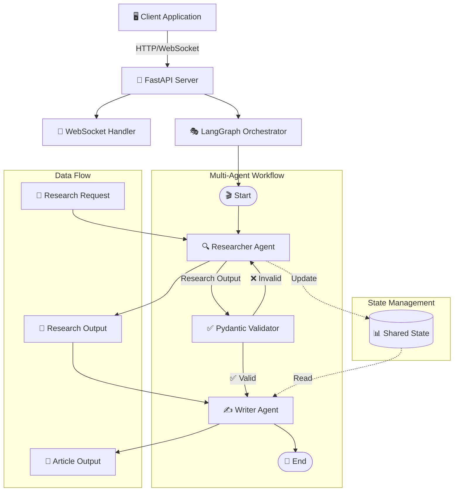
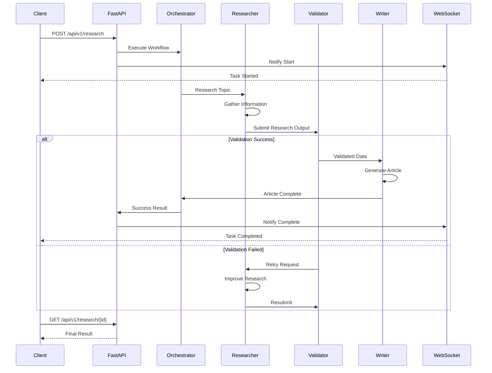

# 🤖 Multi-Agent Orchestrator

<div align="center">

[](https://www.python.org/downloads/)
[](https://fastapi.tiangolo.com/)
[](https://github.com/langchain-ai/langgraph)
[](https://www.docker.com/)
[](https://opensource.org/licenses/MIT)

[](https://github.com/zzzf1ame/multi-agent-orchestrator/actions)
[](https://github.com/zzzf1ame/multi-agent-orchestrator)
[](https://github.com/zzzf1ame/multi-agent-orchestrator)

**🏆 Production-ready multi-agent orchestration system built with Python, LangGraph, and FastAPI**

*Features real-time WebSocket communication, structured state management, and cloud-ready deployment*

[🚀 Quick Start](#-quick-start) • [📖 Documentation](#-api-documentation) • [🐳 Deploy](#-docker-deployment) • [🤝 Contributing](#-contributing)

</div>

---

## 🌟 Features

- **Multi-Agent Architecture**: Researcher and Writer agents working in orchestrated workflow
- **State Management**: Shared state using LangGraph for seamless agent communication
- **Type Safety**: Pydantic models for structured data validation
- **Real-time Updates**: WebSocket support for live progress tracking
- **Production Ready**: Docker containerization with docker-compose
- **API First**: RESTful and WebSocket APIs built with FastAPI
- **Extensible**: Easy to add new agents and workflows

## 🏗️ Architecture

### System Overview


### Agent Interaction Flow


## 🚀 Quick Start

### Prerequisites

- Python 3.11+
- Docker & Docker Compose (optional)
- OpenAI API Key (or other LLM provider)

### Local Development

1. **Clone the repository**
```bash
git clone https://github.com/zzzf1ame/multi-agent-orchestrator.git
cd multi-agent-orchestrator
```

2. **Create virtual environment**
```bash
python -m venv venv
source venv/bin/activate  # On Windows: venv\Scripts\activate
```

3. **Install dependencies**
```bash
pip install -r requirements.txt
```

4. **Set environment variables**
```bash
cp .env.example .env
# Edit .env with your API keys
```

5. **Run the server**
```bash
uvicorn src.main:app --reload --host 0.0.0.0 --port 8000
```

6. **Access the API**
- API Docs: http://localhost:8000/docs
- WebSocket Test: http://localhost:8000/ws-test

### Docker Deployment

```bash
docker-compose up --build
```

## 📊 Data Validation & Output Examples

### Pydantic-Validated Research Output
Our system ensures data integrity through strict Pydantic validation. Here's an example of a validated research output:

```json
{
  "topic": "Artificial Intelligence trends in 2024",
  "summary": "Artificial Intelligence continues to evolve rapidly in 2024, with significant advancements in generative AI, multi-modal models, and enterprise adoption. The field is experiencing unprecedented growth in both capability and practical applications across industries.",
  "key_findings": [
    "Generative AI adoption increased by 300% in enterprise environments",
    "Multi-modal models combining text, image, and audio are becoming mainstream",
    "AI ethics and governance frameworks are being rapidly developed",
    "Edge AI deployment is accelerating for real-time applications",
    "AI-human collaboration tools are reshaping workplace productivity"
  ],
  "sources": [
    {
      "title": "Enterprise AI Adoption Report 2024",
      "url": "https://example.com/ai-report-2024",
      "type": "industry_report",
      "date": "2024"
    },
    {
      "title": "Multi-Modal AI: The Next Frontier",
      "url": "https://example.com/multimodal-ai-study",
      "type": "academic_paper",
      "date": "2024"
    }
  ],
  "metadata": {
    "depth": "detailed",
    "agent": "Researcher",
    "confidence_score": 0.92,
    "processing_time_ms": 1247,
    "validation_passed": true
  },
  "timestamp": "2024-03-10T14:30:45.123456Z"
}
```

### Complete Task Result
```json
{
  "task_id": "task_a1b2c3d4",
  "status": "completed",
  "research": {
    "topic": "Artificial Intelligence trends in 2024",
    "summary": "Comprehensive analysis of AI developments...",
    "key_findings": ["Finding 1", "Finding 2", "Finding 3"],
    "sources": [{"title": "Source 1", "url": "https://example.com"}],
    "metadata": {"confidence": 0.92, "agent": "Researcher"},
    "timestamp": "2024-03-10T14:30:45.123456Z"
  },
  "article": {
    "title": "The Future of AI: Comprehensive Analysis of 2024 Trends",
    "content": "## Executive Summary\n\nArtificial Intelligence continues...",
    "word_count": 1847,
    "sections": [
      "Executive Summary",
      "Key Findings", 
      "Detailed Analysis",
      "Implications",
      "Conclusion"
    ],
    "research_reference": "task_a1b2c3d4",
    "timestamp": "2024-03-10T14:32:18.987654Z"
  },
  "started_at": "2024-03-10T14:30:12.000000Z",
  "completed_at": "2024-03-10T14:32:19.000000Z",
  "duration_seconds": 127.0,
  "error": null
}
```

### WebSocket Real-time Updates
```json
{
  "type": "task_update",
  "task_id": "task_a1b2c3d4",
  "status": "researching",
  "message": "Researcher agent is analyzing sources and gathering insights...",
  "data": {
    "progress": 65,
    "current_step": "source_analysis",
    "sources_processed": 3,
    "total_sources": 5
  },
  "timestamp": "2024-03-10T14:30:45.123456Z"
}
```

## 📖 API Documentation

#### Create Research Task
```http
POST /api/v1/research
Content-Type: application/json

{
  "topic": "Artificial Intelligence trends in 2024",
  "depth": "detailed"
}
```

#### Get Task Status
```http
GET /api/v1/research/{task_id}
```

### WebSocket

Connect to `/ws/{client_id}` for real-time updates:

```javascript
const ws = new WebSocket('ws://localhost:8000/ws/client123');
ws.onmessage = (event) => {
  const data = JSON.parse(event.data);
  console.log(data);
};
```

## 🧪 Testing

```bash
# Run all tests
pytest

# Run with coverage
pytest --cov=src --cov-report=html

# Run specific test file
pytest tests/test_agents.py
```

## 📦 Project Structure

```
multi-agent-orchestrator/
├── src/
│   ├── agents/           # Agent implementations
│   ├── models/           # Pydantic models
│   ├── orchestrator/     # LangGraph workflow
│   ├── api/              # FastAPI routes
│   └── main.py           # Application entry point
├── tests/                # Test suite
├── docs/                 # Documentation
├── docker/               # Docker configurations
├── .github/              # CI/CD workflows
├── Dockerfile
├── docker-compose.yml
├── requirements.txt
└── README.md
```

## 🔧 Configuration

Environment variables in `.env`:

```env
OPENAI_API_KEY=your_key_here
LOG_LEVEL=INFO
MAX_WORKERS=4
REDIS_URL=redis://localhost:6379
```

## 🤝 Contributing

Contributions are welcome! Please read [CONTRIBUTING.md](CONTRIBUTING.md) for details.

1. Fork the repository
2. Create your feature branch (`git checkout -b feature/AmazingFeature`)
3. Commit your changes (`git commit -m 'Add some AmazingFeature'`)
4. Push to the branch (`git push origin feature/AmazingFeature`)
5. Open a Pull Request

## 📄 License

This project is licensed under the MIT License - see the [LICENSE](LICENSE) file for details.

## 🙏 Acknowledgments

- [LangGraph](https://github.com/langchain-ai/langgraph) for agent orchestration
- [FastAPI](https://fastapi.tiangolo.com/) for the web framework
- [Pydantic](https://pydantic-docs.helpmanual.io/) for data validation

## 📧 Contact

Your Name - [@zzzf1ame](https://github.com/zzzf1ame)

Project Link: [https://github.com/zzzf1ame/multi-agent-orchestrator](https://github.com/zzzf1ame/multi-agent-orchestrator)

---

## ⭐ Star History

<div align="center">

[](https://star-history.com/#zzzf1ame/multi-agent-orchestrator&Date)

</div>

---

**⭐ Star this repository if you find it helpful!**

<div align="center">
  <sub>Built with ❤️ by <a href="https://github.com/zzzf1ame">zzzf1ame</a></sub>
</div>
