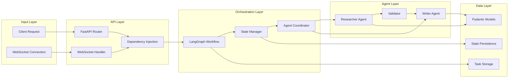
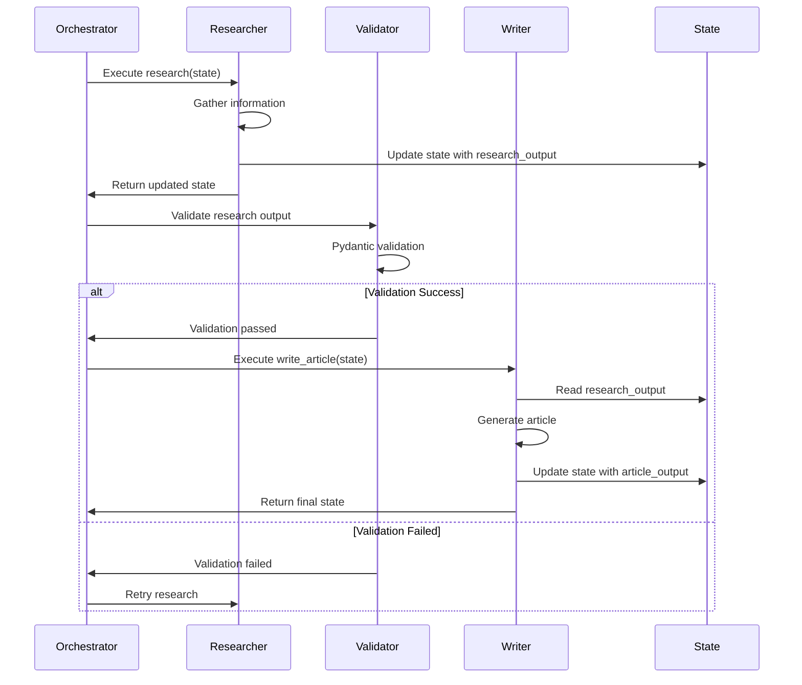

# 🏗️ Architecture Documentation

## System Overview

The Multi-Agent Orchestrator is built using a modern, scalable architecture that combines the power of LangGraph for agent orchestration with FastAPI for high-performance web services.

## Core Components

### 1. FastAPI Application Layer
- **Purpose**: HTTP/WebSocket API endpoints
- **Responsibilities**: Request handling, response formatting, authentication
- **Key Features**: Auto-generated OpenAPI docs, async support, WebSocket real-time communication

### 2. LangGraph Orchestrator
- **Purpose**: Multi-agent workflow management
- **Responsibilities**: State management, agent coordination, flow control
- **Key Features**: Conditional routing, retry logic, state persistence

### 3. Agent Layer
- **Researcher Agent**: Information gathering and analysis
- **Writer Agent**: Content generation based on research
- **Extensible**: Easy to add new specialized agents

### 4. Data Validation Layer
- **Pydantic Models**: Strict type checking and validation
- **Schema Enforcement**: Ensures data integrity between agents
- **Serialization**: JSON serialization with validation

## Data Flow Architecture



## State Management

### Agent State Schema
```python
class AgentState(BaseModel):
    task_id: str
    topic: str
    depth: ResearchDepth
    max_sources: int
    research_output: Optional[ResearchOutput] = None
    article_output: Optional[ArticleOutput] = None
    current_step: str = "initialized"
    errors: List[str] = Field(default_factory=list)
    metadata: Dict[str, Any] = Field(default_factory=dict)
```

### State Transitions
1. **Initialized** → Research request created
2. **Researching** → Researcher agent active
3. **Validating** → Pydantic validation in progress
4. **Writing** → Writer agent active
5. **Completed** → Task finished successfully
6. **Failed** → Error occurred during processing

## Agent Communication

### Inter-Agent Data Flow


## Scalability Considerations

### Horizontal Scaling
- **Stateless Design**: Each request is independent
- **Load Balancing**: Multiple FastAPI instances
- **Task Distribution**: Redis-based task queue (future enhancement)

### Performance Optimization
- **Async Operations**: Non-blocking I/O throughout
- **Connection Pooling**: Database and Redis connections
- **Caching**: Redis for frequently accessed data
- **Background Tasks**: Long-running operations in background

### Resource Management
- **Memory**: Efficient state management with cleanup
- **CPU**: Async processing prevents blocking
- **I/O**: Optimized database queries and API calls

## Security Architecture

### Authentication & Authorization
- **API Keys**: For external service access
- **Rate Limiting**: Nginx-based request throttling
- **CORS**: Configurable cross-origin policies

### Data Protection
- **Input Validation**: Pydantic schema enforcement
- **Output Sanitization**: Clean data before responses
- **Error Handling**: No sensitive data in error messages

### Infrastructure Security
- **Container Security**: Non-root user, minimal base image
- **Network Security**: Internal service communication
- **Secrets Management**: Environment-based configuration

## Monitoring & Observability

### Logging Strategy
```python
# Structured logging with context
logger.info(
    "Task completed",
    extra={
        "task_id": task_id,
        "duration_ms": duration,
        "agent": "researcher",
        "status": "success"
    }
)
```

### Metrics Collection
- **Request Metrics**: Response times, error rates
- **Agent Metrics**: Task completion rates, processing times
- **System Metrics**: Memory usage, CPU utilization

### Health Checks
- **Application Health**: `/health` endpoint
- **Dependency Health**: Database, Redis connectivity
- **Agent Health**: LLM service availability

## Deployment Architecture

### Container Strategy
```dockerfile
# Multi-stage build for optimization
FROM python:3.11-slim as builder
# ... build dependencies

FROM python:3.11-slim as production
# ... runtime environment
```

### Service Orchestration
```yaml
# docker-compose.yml structure
services:
  orchestrator:    # Main application
  redis:          # State storage
  nginx:          # Reverse proxy
  prometheus:     # Metrics collection
  grafana:        # Visualization
```

### Cloud Deployment Options
1. **Docker Compose**: Single-node deployment
2. **Kubernetes**: Multi-node orchestration
3. **Cloud Services**: AWS ECS, Google Cloud Run
4. **Serverless**: AWS Lambda with API Gateway

## Extension Points

### Adding New Agents
```python
class CustomAgent:
    def __init__(self, llm=None):
        self.llm = llm
        self.name = "CustomAgent"
    
    async def execute(self, state: AgentState) -> Dict[str, Any]:
        # Custom agent logic
        return {"custom_output": result}
```

### Custom Workflows
```python
# Add new nodes to workflow
workflow.add_node("custom_agent", self._custom_node)
workflow.add_edge("researcher", "custom_agent")
workflow.add_edge("custom_agent", "writer")
```

### Integration Points
- **External APIs**: HTTP clients for data sources
- **Databases**: SQLAlchemy for persistent storage
- **Message Queues**: Celery for distributed tasks
- **Monitoring**: Custom metrics and alerts

## Performance Benchmarks

### Expected Performance
- **API Response Time**: < 100ms for status endpoints
- **WebSocket Latency**: < 50ms for real-time updates
- **Task Processing**: 30-120 seconds depending on complexity
- **Concurrent Users**: 100+ with proper scaling

### Optimization Strategies
1. **Caching**: Redis for frequently accessed data
2. **Connection Pooling**: Reuse database connections
3. **Async Processing**: Non-blocking operations
4. **Resource Limits**: Container memory/CPU constraints